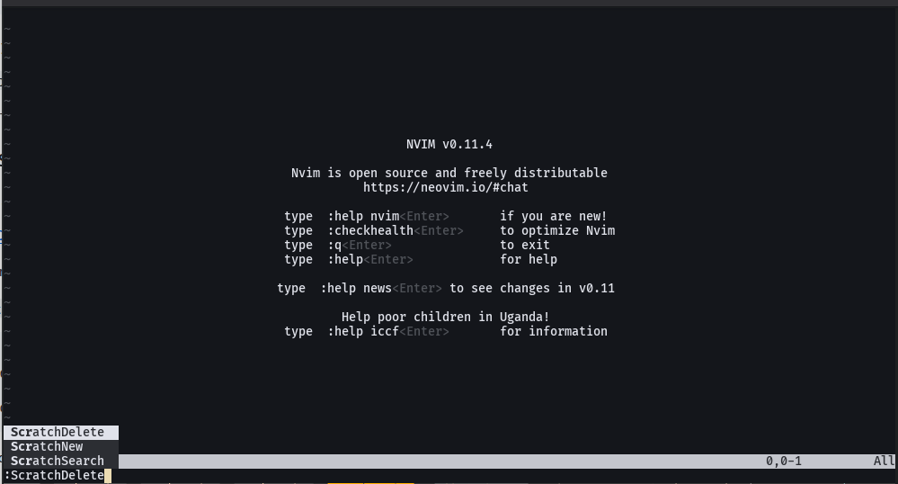

+++
date = '2025-09-22T14:11:56-04:00'
title = 'How to create a Neovim plugin'
draft = false
tags = [ 'Neovim', 'Plugin' ]
categories = [ 'Development' ]
+++

This article's intention is to explain how to create a basic neovim plugin,
letting you understand the basics about its structure, how to add functionality,
add customizable config and finally expose new commands for users.

<!--more-->

## Table of content

<!-- toc -->

- [Why Create a Neovim Plugin?](#why-create-a-neovim-plugin)
- [Tutorial Steps](#tutorial-steps)
  - [Step 1. Create a new repository](#step-1-create-a-new-repository)
  - [Step 2. Plugin File Structure](#step-2-plugin-file-structure)
  - [Step 3. Initial code for the plugin](#step-3-initial-code-for-the-plugin)
  - [Step 4. Testing your new plugin](#step-4-testing-your-new-plugin)
    - [Testing in a clean setup](#testing-in-a-clean-setup)
    - [Adding your plugin to your existing setup](#adding-your-plugin-to-your-existing-setup)
      - [Packer](#packer)
      - [Lazy.nvim](#lazynvim)
  - [Step 5. Adding config settings](#step-5-adding-config-settings)
  - [Step 6. Defining Functionality](#step-6-defining-functionality)
  - [Step 7. Exposing Commands](#step-7-exposing-commands)
  - [Step 8. Implementing the actual logic for the plugin](#step-8-implementing-the-actual-logic-for-the-plugin)
    - [Enhanced configuration](#enhanced-configuration)
    - [Shared Core functionality](#shared-core-functionality)
    - [Core functionality](#core-functionality)
  - [Finally add documentation for your plugin](#finally-add-documentation-for-your-plugin)
- [Results](#results)
  - [Using a clean install](#using-a-clean-install)
  - [Including it in your Neovim setup](#including-it-in-your-neovim-setup)
- [Conclusion](#conclusion)

<!-- tocstop -->

## Why Create a Neovim Plugin?

Neovim isn't just a text editor—it's a productivity powerhouse for developers,
writers, and creators alike. What's truly exciting about Neovim is its ability
to adapt to your workflow through plugins. Whether you're looking to automate
repetitive tasks, enhance your coding experience, or add a personal touch to
your editor, plugins can make it happen. And the best part? You can create your
own plugin tailored to your needs, even if you're new to coding or Neovim.
Let's dive into how to make that happen!

## Tutorial Steps

Please follow those steps using your tools of preference.

### Step 1. Create a new repository

First step to create a plugin for people to include it in their Neovim setups
is to create a public repository.

- You can create it on github.com
- You must select the name for the plugin, when written in lua for neovim you
  can add ".nvim" to make it explicit.
- Add a description for your repository.
- You can choose to create a README.md file
- You can add a default .gitignore file

  

Now you must clone the repository in your local machine (I will use
`~/Development/contrib/` as the location for my plugin repository folder):

- You can do it from the code editor directly (i.e. Neovim, VsCode, Sublime, etc.)
- Using a git UI client (i.e. [Github
  desktop](https://github.com/apps/desktop),
  [GitKraken](https://www.gitkraken.com/git-client),
  [SourceTree](https://www.sourcetreeapp.com/), etc.)
- Using your terminal:

  ```bash
  git clone <Your repository url>
  ```

  For this tutorial my repository url is:

  ```bash
  git clone git@github.com:diegoortizmatajira/workspace-scratch-files.nvim.git
  ```

Now you are ready to start working in your plugin.

### Step 2. Plugin File Structure

Before diving into code, it’s important to understand how plugins are
organized. At its core, a Neovim plugin is just a collection of script files,
often written in Lua or Vimscript. These files are responsible for adding
functionality to your editor.

Here’s a simple structure to keep in mind where `myplugin` is the name you gave
to your plugin:

```text
myplugin.nvim/
├── lua/
│   └── myplugin/
│       └── init.lua
└── README.md
```

- **lua/**: This folder contains all Lua scripts.
- **myplugin/**: A namespace for your plugin files.
- **init.lua**: This is the entry point for your plugin.

Keeping your plugin well-structured not only helps you stay organized but also
makes it easier for others to contribute.

For this tutorial we'll start by creating the following basic structure:

```text
~/Development/contrib/workspace-scratch-files.nvim/..
├── lua
│   └── workspace-scratch-files
│       └── init.lua
├── .gitignore
├── LICENSE
└── README.md
```

### Step 3. Initial code for the plugin

In `workspace-scratch-files/init.lua`, start with something simple like:

```lua
local M = {}

function M.setup()
    -- Your setup code here
    vim.notify("Workspace Scratch Files initialized")
end

return M
```

This will give you a working plugin that simply prints a message when setup.

### Step 4. Testing your new plugin

If you want to test your plugin, you have two options:

- Testing it in a clean setup
- Adding the plugin to your existing setup

#### Testing in a clean setup

You can create a test `init.lua` file and start Neovim with this init config file.

```bash
nvim -u <your test init.lua>

```

For example you can add a `test/init.lua` file with the next content:

```lua
--- You will be adding your plugin code the runtime path (to use it without a
--- plugin manager)

vim.opt.runtimepath:prepend(vim.fn.getcwd())

local plugin = require("workspace-scratch-files")
plugin.setup()

```

Then, from the **root folder in your repository** you can run the following command
in a terminal (this tells Neovim to use our test init config file):

```bash
nvim -u test/init.lua
```

And you will see this (note the message at the bottom):


#### Adding your plugin to your existing setup

If you want to add your plugin, you will need to add your repository path into
your plugin manager as a new plugin, those instructions will depend on your
plugin manager, here are the examples in Packer and Lazy.nvim:

##### Packer

```lua
use {
    "~/Development/contrib/workspace-scratch-files.nvim",
    config = function()
        require("workspace-scratch-files").setup()
    end
}
```

##### Lazy.nvim

```lua
{
    dir = "~/Development/contrib/workspace-scratch-files.nvim",
    opts = {}
}
```

And you will see your normal setup and the new plugin added to it (note the
notification popup at the bottom-right corner):



You can see the code in the repository at this stage in github at the
[Steps-1-to-3](https://github.com/diegoortizmatajira/workspace-scratch-files.nvim/tree/steps-1-to-3)
tag


### Step 5. Adding config settings

Create a `workspace-scratch-files/config.lua` module file.

It is recommended (Not mandatory) to add comments and annotations to the types
definitions, to help any further development to be consistent and
self-documented.

```lua
--- @class Scratch.config
--- @field test_message string A test message for demonstration purposes.

local C = {
    --- Default configuration settings for the Scratch plugin.
    --- @type Scratch.config
    default = {
        test_message = "Hello from Scratch plugin!",
    },
    --- Current configuration settings for the Scratch plugin.
    --- @type Scratch.config?
    current = nil,
}

--- Updates the current configuration with a new configuration.
--- If the provided configuration is not a table or is nil, the update is ignored.
--- @param new_config? Scratch.config new configuraton to be applied
function C.update(new_config)
    --- Initializes or overrides the current configuration with the new configuration.
    --- If no current configuration exists, it defaults to the default configuration.
    C.current = vim.tbl_deep_extend("force", C.current or C.default, new_config
        or {})
end

return C
```

Back into `workspace-scratch-files/init.lua`, modify the code to use our config module

```lua
local config = require("workspace-scratch-files.config")

local M = {}

function M.setup(opts)
    config.update(opts)
    -- Your setup code here
    vim.notify(config.current.test_message)
end

return M
```

if we just run our test environment without adding specific configuration, we
will get the default message:


If we provide custom settings in our clean setup(`test/init.lua`):

```lua {hl_lines=["7-9"]}
--- You will be adding your plugin code the runtime path (to use it without a
--- plugin manager)

vim.opt.runtimepath:prepend(vim.fn.getcwd())

local plugin = require("workspace-scratch-files")
plugin.setup({
    test_message = "This is a custom test message!",
})

```

or modify the plugin options in our plugin manager:

- Packer

  ```lua {hl_lines=["4-6"]}
  use {
    "~/Development/contrib/workspace-scratch-files.nvim",
    config = function()
        require("workspace-scratch-files").setup({
            test_message = "This is a custom test message!",
        })
    end
  }
  ```

- Lazy.nvim

  ```lua {hl_lines=["3-5"]}
  {
    dir = "~/Development/contrib/workspace-scratch-files.nvim",
    opts = {
        test_message = "This is a custom test message!",
    }
  }
  ```

You will see something like the following result (see customized message at the bottom):


### Step 6. Defining Functionality

Now we are going to create the code that defines the functionality we want to
expose.

Note: We can implement this part directly in init.lua, but it is recommended to
have a clear separation of responsibilities:

- init.lua: Only exposes the setup method and commands to neovim.
- individual additional modules implement specific features only, this way it
  is easier to manage how they are implemented.

So, we are going to create an individual module for the actual implementation
of our features, we can start just creating the placeholders for each function.

Let's create a new file `workspace-scratch-files/core.lua` with:

```lua
local M = {}

function M.delete_scratch_file(file_path)
    vim.notify("Deleting scratch file: " .. file_path)
end

function M.search_scratch_files()
    vim.notify("Searching scratch files...")
end

function M.create_scratch_file()
    vim.notify("Creating a new scratch file...")
end

return M

```

Actual implementation will be done later, for now we have defined our features
in this core module.

### Step 7. Exposing Commands

Exposing commands makes it easy for users to interact with your plugin. Always
choose clear and descriptive names for these commands. Use
[vim.api.nvim_create_user_command](<https://neovim.io/doc/user/api.html#nvim_create_user_command()>)
to define them, as shown below.

`workspace-scratch-files/init.lua`:

```lua {hl_lines=[2,"10-19"]}
local config = require("workspace-scratch-files.config")
local core = require("workspace-scratch-files.core")

local M = {}

function M.setup(opts)
    config.update(opts)
    -- Your setup code here
    vim.notify(config.current.test_message)
    -- Create user commands: ScratchDelete, ScratchSearch, ScratchNew
    vim.api.nvim_create_user_command("ScratchNew", function()
        core.create_scratch_file()
    end, { nargs = 0 })
    vim.api.nvim_create_user_command("ScratchSearch", function()
        core.search_scratch_files()
    end, { nargs = 0 })
    vim.api.nvim_create_user_command("ScratchDelete", function()
        core.delete_scratch_file()
    end, { nargs = 0 })
end

return M
```

Now you can run your neovim test environment and see our three commands
available in neovim (If you run them, they will display their corresponding
test messages):



For example if you execute `:ScratchSearch` you will see:



You can see the code in the repository at this stage in github at the
[Steps-4-to-7](https://github.com/diegoortizmatajira/workspace-scratch-files.nvim/tree/Steps-4-to-7)
tag


### Step 8. Implementing the actual logic for the plugin

Now, we are ready to implement the actual logic for our scratches plugin.

Goals:

- We want to have global or workspace specific scratches (2 default sources).
- We want to let any user to add custom folders for storing his scratches
  (custom sources).
- We want to retrieve all scratch files from all possible sources.
- We want to search and select scratch files knowing its source (by having an
  icon).
- We want to create new scratch files, and selecting where (which source) to
  use to store our new scratch file.

#### Enhanced configuration

First lets make our configuration available for users:

Modify `workspace-scratch-files/config.lua`:

Lets add the type definition for our config

```lua {hl_lines=["2-5"]}
--- @class Scratch.config
--- @field sources table<string, string|fun():string> A table containing source
--- paths for scratch files.
--- @field icons table<string, string> A table containing icons for different
--- scratch file sources.
```

Lets add some functions to be used as sources:

```lua
local folder = "/ws-scratches"

--- Retrieves the path for the workspace-specific scratch file source.
--- This function constructs a unique directory path based on the current
--- working directory.
--- The uniqueness is achieved by combining the last folder
--- name of the current working directory with the first 8 characters of its
--- SHA-256 hash.
--- @return string The path to the workspace-specific scratch file source.
local function get_workspace_source()
    local cwd = vim.fn.getcwd()
    -- Get the last folder name of the current working directory
    local last_folder = vim.fn.fnamemodify(vim.fn.getcwd(), ":t")
    -- Hash the current working directory to ensure uniqueness
    local hashed = vim.fn.sha256(cwd)
    -- Create a custom name using the last folder and the first 8 characters of
    -- the hash
    local custom_name = string.format("%s - %s", last_folder,
        string.sub(hashed, 1, 8))
    return vim.fn.stdpath("data") .. folder .. "/" .. custom_name .. "/"
end

--- Retrieves the path for the global scratch file source.
--- This function returns the default directory path where global scratch files
--- are stored.
--- The path is based on the standard data directory of Neovim.
--- @return string The path to the global scratch file source.
local function get_global_source()
    return vim.fn.stdpath("data") .. folder .. "/global/"
end

```

Now set the default config:

```lua {hl_lines=["5-13"]}
local C = {
    --- Default configuration settings for the Scratch plugin.
    --- @type Scratch.config
    default = {
        sources = {
            global = get_global_source,
            workspace = get_workspace_source,
        },
        icons = {
            global = "🌐",
            workspace = " ",
            default = "󰚝 ",
        },
    },
    --- Current configuration settings for the Scratch plugin.
    --- @type Scratch.config?
    current = nil,
}

```

#### Shared Core functionality

Let's define some support types for our logic in `workspace-scratch-files/core.lua`:

```lua
--- @class Scratch.File
--- @field path string The full path to the scratch file.
--- @field icon string The icon associated with the scratch file.
--- @field source string The source type of the scratch file (e.g., "global", "workspace").

--- @class Scratch.Source
--- @field path string The path to the source directory.
--- @field icon string The icon associated with the source.
--- @field source string The name of the source.
```

Now some reusable logic, for obtaining user-friendly lists from configuration,
and select items:

```lua
--- Retrieves all configured sources for scratch files.
--- @return Scratch.Source[] A list of sources with their paths and icons.
local function get_sources()
    local sources = {}
    for source, path_or_func in pairs(config.current.sources) do
        local path = type(path_or_func) == "function" and path_or_func() or path_or_func
        local icon = config.current.icons[source] or config.current.icons.default
        table.insert(sources, {
            path = path,
            icon = icon,
            source = source,
        })
    end
    return sources
end

--- Retrieves all files from the specified source path.
--- @param source_path string The path to the source directory.
--- @param icon string The icon associated with the source.
--- @param source string The name of the source.
--- @return Scratch.File[] A list of scratch files found in the source directory.
local function get_scratches_from(source_path, icon, source)
    -- Use vim.fn.glob to get all files in the directory
    local files = vim.fn.glob(source_path .. "*", false, true)
    local scratch_files = {}
    for _, file in ipairs(files) do
        table.insert(scratch_files, {
            path = file,
            icon = icon,
            source = source,
        })
    end
    return scratch_files
end

--- Prompts the user to select a scratch file from all available sources and
--- opens it. If no configuration is found or no scratch files are available,
--- appropriate notifications are shown.
--- @param callback fun(file: Scratch.File) A callback function to be called
--- with the selected file.
local function select_file(callback)
    if not config.current then
        vim.notify("Configuration not found!", vim.log.levels.ERROR)
        return
    end
    local all_files = {}
    --- Iterate over each source in the configuration
    for source, path_or_func in pairs(config.current.sources) do
        --- Determine the path based on whether it's a function or a string
        local path = type(path_or_func) == "function" and path_or_func() or path_or_func
        local icon = config.current.icons[source] or config.current.icons.default
        local files = get_scratches_from(path, icon, source)
        vim.list_extend(all_files, files)
    end
    if vim.tbl_isempty(all_files) then
        vim.notify("No scratch files found.", vim.log.levels.WARN)
        return
    end
    vim.ui.select(all_files, {
        format_item = function(item)
            return string.format("%s %s (%s)", item.icon,
                vim.fn.fnamemodify(item.path, ":t"), item.source)
        end,
    }, callback)
end

```

#### Core functionality

Let's update the scaffolded methods we created before in `workspace-scratch-files/core.lua`:

For deleting a scratch file, we will need to select it, confirm and finally
remove it.

```lua {hl_lines=["2-23"]}
function M.delete_scratch_file()
    select_file(function(item)
        if item then
            --- Confirm deletion
            vim.ui.input(
                { prompt = "Are you sure you want to delete " ..
                    vim.fn.fnamemodify(item.path, ":t") .. "? (y/n): " },
                function(input)
                    if input and (input:lower() == "y"
                        or input:lower() == "yes") then
                        local success, err = os.remove(item.path)
                        if success then
                            vim.notify("Deleted scratch file: " .. item.path)
                        else
                            vim.notify("Error deleting file: " .. err, vim.log.levels.ERROR)
                        end
                    else
                        vim.notify("Deletion cancelled.", vim.log.levels.INFO)
                    end
                end
            )
        end
    end)
end

```

For searching a single scratch file, we select it and open it:

```lua {hl_lines=["2-6"]}
function M.search_scratch_files()
    select_file(function(item)
        if item then
            vim.cmd("edit " .. item.path)
        end
    end)
end

```

For creating a new scratch file, we need to ask the user for the type of
scratch file (selecting a source), then ask for a filename, and finally open
such file:

```lua {hl_lines=["3-30"]}
function M.create_scratch_file()
    vim.notify("Creating a new scratch file...")
    vim.ui.select(get_sources(), {
        prompt = "Select Scratch File Source:",
        format_item = function(item)
            return string.format("%s %s", item.icon, item.source)
        end,
    }, function(source)
        if not source then
            vim.notify("Scratch file creation cancelled.", vim.log.levels.WARN)
            return
        end
        vim.ui.input({ prompt = "Enter scratch file name: " }, function(input)
            if not input or input == "" then
                vim.notify(
                        "Invalid file name. Scratch file creation cancelled.",
                        vim.log.levels.ERROR)
                return
            end
            local full_path = source.path .. input
            -- Ensure the directory exists
            vim.fn.mkdir(vim.fn.fnamemodify(full_path, ":h"), "p")
            -- Create the file if it doesn't exist and open it
            if vim.fn.filereadable(full_path) == 0 then
                vim.fn.writefile({}, full_path)
            end
            vim.cmd("edit " .. full_path)
            vim.notify("Created new scratch file: " .. full_path)
        end)
    end)
end

```


You can see the code in the repository at this stage in github at the
[Steps-8](https://github.com/diegoortizmatajira/workspace-scratch-files.nvim/tree/Step-8)
tag


### Finally add documentation for your plugin

You will need to add proper documentation to your plugin repository.

---

## Results

### Using a clean install

Creating a new scratch file


Providing the file name


Selection of existing scratch files:


### Including it in your Neovim setup

Including it into your existing setup with plugins such as Telescope.

Selecting the source for a new scratch file


Providing the new file name


Selecting existing scratch files


## Conclusion

Thank you for following along in this tutorial! This is my first post, and I
hope you found it helpful and inspiring. I am planning to share more posts like
this in the future, so stay tuned for more content. Your feedback is always
appreciated.
